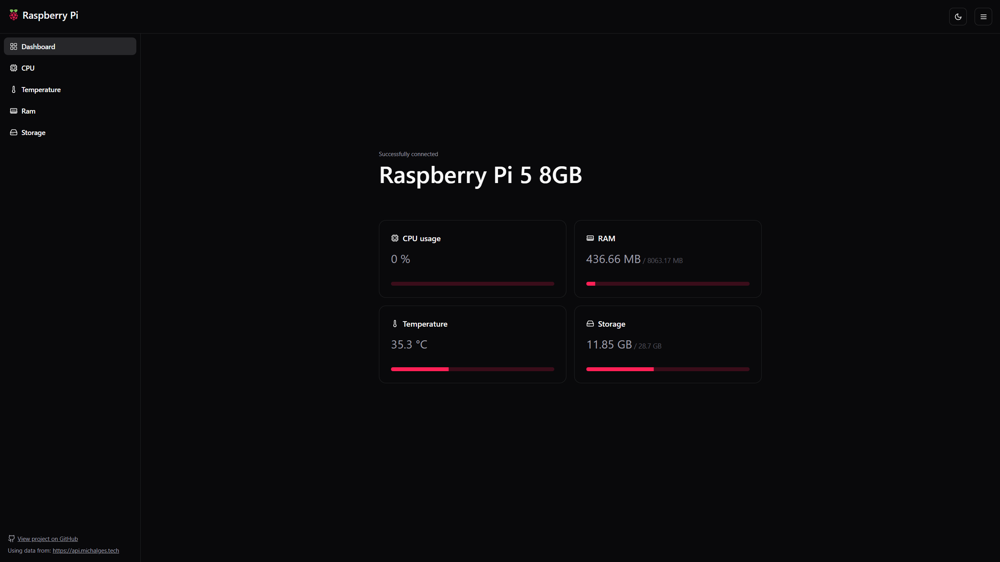

# Raspberry Pi Monitoring Web App

A lightweight web application designed to run on your Raspberry Pi, providing real-time monitoring of system metrics including CPU usage, temperature, RAM, and storage.

This app is designed to work alongside the [hardware info API](https://github.com/michalges/raspberrypi-hardware-info-api), which provides the system metrics.



## Used Technologies

- Next.js
- TypeScript
- shadcn/ui
- Tailwind CSS
- Docker

## Requirements

- Any Raspberry Pi model
- Docker and Git installed on the Raspberry Pi

## How to Run

> Note: To run the aplication, you also need [hardware info API](https://github.com/michalges/raspberrypi-hardware-info-api), which provides endpoints with system metrics.

1. Clone the repository:

    ```bash
    git clone https://github.com/michalges/raspberrypi-web-app
    cd raspberrypi-web-app
    ```

2. Run the Docker script:

    ```bash
    ./docker.sh
    ```

    This script builds and runs the web app in a Docker container. It also ensures the app will automatically restart and keep running on each boot.

3. Create `.env` file

    ```env
    NEXT_PUBLIC_API_URL=URL_TO_YOUR_API
    ```

4. Open [http://localhost:8000](http://localhost:8000) in your browser to access the web interface.
